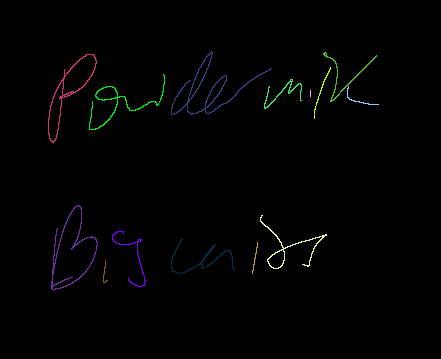

# tablet-thing

Uses [a fork](https://github.com/zphixon/winit) of [winit](https://github.com/rust-windowing/winit) that adds the pen inverted state. Only works on Windows.

## Building:

The winit fork is cloned automatically if you cloned with `--recurse-submodules`, but glutin's `glutin/glutin/Cargo.toml` needs to be manually edited to point the winit dependency to the `winit2` directory. Yes, this is cursed. I apologize.

## Features:

- Strokes can be drawn, undone, and erased

## Todo:

- Better handling of the effects of pen pressure on stroke width
- Make graphics handling better
  - Move all the GL stuff into `State`, maybe in a way that allows multiple backends
  - Antialiasing for free (`glEnable(GL_MULTISAMPLING)`)
- Geometry-based rather than pixel-based rendering, includes compositing
  - Splines with `lyon_tesselation`
- Any sort of GUI
  - Undo system
  - Layers?

## Notes

Coordinate types:
- `PhysicalPosition` - pixels in window, provided by winit
- `GlPos` - NDC used to calculate where the user is clicking
- `StrokePoint` - stroke position relative to NDC origin in stroke space
- `StrokePos` - stroke position relative to stroke space origin

