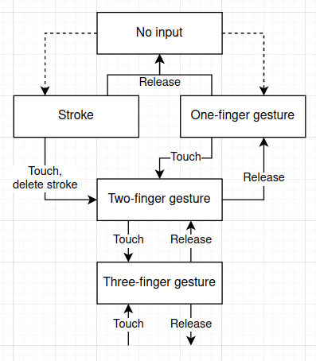

# Powdermilk Biscuits


Heavens, it's tasty.

## Building:

The command

```
git clone --recurse-submodules https://github.com/zphixon/powdermilk-biscuits
```

will download the submodules [winit](https://github.com/zphixon/winit) and [rfd](https://github.com/zphixon/rfd) and have them in the correct state but [glutin](https://github.com/rust-windowing/glutin) needs to have its winit dependency manually changed to point to the `winit2` directory by changing the line in `[dependencies]` as follows:

```diff
-winit = { version = "0.26", default-features = false }
+winit = { path = "../../winit2", default-features = false }
```

## Features:

- Strokes can be drawn, undone, and erased
- Files can be saved and opened

## Todo:

- Make graphics better
  - Move all the GL stuff into `State`, maybe in a way that allows multiple backends
- Geometry-based rather than pixel-based rendering, includes compositing
  - Splines with `lyon_tesselation`
- Any sort of GUI
  - Undo system
  - Layers?
  - Customization
- Finger gestures
- Chunk-based strokes

## Notes

Coordinate types:
- `PhysicalPosition` - pixels in window, provided by winit
- `GlPos` - NDC used to calculate where the user is clicking
- `StrokePoint` - stroke position relative to NDC origin in stroke space
- `StrokePos` - stroke position relative to stroke space origin

Finger/stylus interaction:
- `Touch` events have a unique ID to represent different touches. The behavior for recognizing touch gestures should be:
  - When we get a `Touch` event, remember the ID. Set the pen state to down.
  - While the pen is down, if we receive another `Touch` event with a different ID:
    - Remember the ID of the new touch
    - Remove the stroke currently being drawn, set the pen state to up
    - Handle the appropriate gesture based on how many concurrent touches there are
    - Wait until all the touches are ended
- Settings - library function that loads and validates settings file, used by build script to check per-platform builds
  - Ignore touch inputs entirely
  - Use touch inputs only for gestures
  - Use mouse inputs as finger/stylus inputs
  - Gesture for each number of fingers
  - Tap gestures

Optimizations
- OpenGL
  - We're uploading data for every stroke on every frame, regardless of whether they're changed
- WGPU
  - We're uploading data for the last stroke every frame, again regardless of whether it's changed


