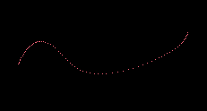

# tablet-thing

Uses [a fork](https://github.com/zphixon/winit) of [winit](https://github.com/rust-windowing/winit) that adds the pen inverted state. Only works on Windows.

## Features:

- Line   
- Circle   
- Circle with pressure scaling   
- Points   
- Strokes can be erased, undone, or cleared
- The image can be saved

## Todo:

- Better handling of the effects of pen pressure on stroke width
- Antialiasing
- Bezier/spline rendering
- Geometry-based rather than pixel-based rendering
- Any sort of GUI
