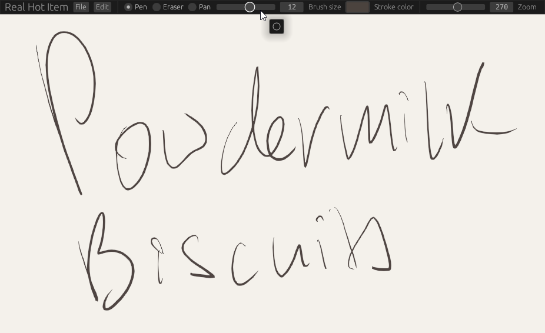
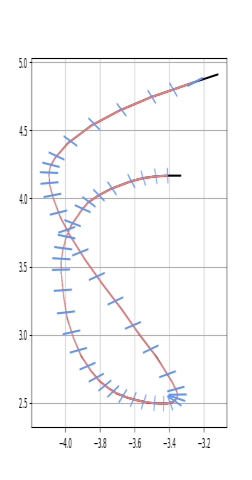

# Powdermilk Biscuits

Heavens, it's tasty.

## Building:

The build has visited the local mage and is no longer cursed. Just `git clone` and `cargo b --release`!

## Features:

- Strokes can be drawn, undone, and erased
- Files can be saved and opened

## Todo:

- Any sort of GUI
  - Undo system
  - Layers?
  - Customization
- Finger gestures
- Stroke rendering revamp
  - Infinite scroll, chunks
  - Pressure-based line weight
  - Caps and joins
  - Correct handling of color space (wgpu impl)

## Notes

Coordinate types:
- `PhysicalPosition` - pixels in window, provided by winit
- `GlPos` - NDC used to calculate where the user is clicking
- `StrokePoint` - stroke position relative to NDC origin in stroke space
- `StrokePos` - stroke position relative to stroke space origin

Finger/stylus interaction:
- `Touch` events have a unique ID to represent different touches. The behavior for recognizing touch gestures should be:
  - When we get a `Touch` event, remember the ID. Set the pen state to down.
  - While the pen is down, if we receive another `Touch` event with a different ID:
    - Remember the ID of the new touch
    - Remove the stroke currently being drawn, set the pen state to up
    - Handle the appropriate gesture based on how many concurrent touches there are
    - Wait until all the touches are ended
- Settings - library function that loads and validates settings file, used by build script to check per-platform builds
  - Ignore touch inputs entirely
  - Use touch inputs only for gestures
  - Use mouse inputs as finger/stylus inputs
  - Gesture for each number of fingers
  - Tap gestures

Optimizations:
- For both backends, we're checking every stroke every frame whether it's been buffered or not
- We probably don't need to store the spline CPU-side, we could just use a ring buffer and keep track of what mesh data hasn't been buffered to the GPU yet
- Save rendered framebuffers and sample them when possible so we don't need to loop through all the strokes every frame
- Rasterize strokes to a texture atlas
  - Atlas texture/sampler bind group
    - Uniform buffer containing texture coordinate offsets
    - Instanced drawing of quads
  - Wet texture/sampler bind group
- Most optimizations require choosing a backend
  - I want piet & wgpu

Backend:
- piet for drawing strokes to a wet texture
- on every frame, re-upload the wet texture (hopefully this is fast?)
- once the stroke is finished
  - allocate the wet texture in the atlas
  - write it to the atlas using glTexSubImage2D or whatever in WGPU
  - use the atlas allocation in the StrokeBackend as a uniform/push constant
- draw atlased strokes with instances and ubos
- how do we notify the backend that a stroke needs to be re-rendered?
  - zooming in would cause the quality of the texture to degrade, when do we decide it's time to ask piet to draw it again and how do we update the texture atlas
  - panning the canvas causes strokes to go out of view, how do we decide when to update the uniform buffer?

roughly speaking, an entire new frame from scratch would look like:
- update instance buffer with the texture and sketch coordinates for visible strokes
- update uniform buffer with atlas width, height, and view matrix
- draw instances
- if there's a wet stroke
  - tell piet to render it
  - upload the resulting texture
  - draw single instance

Keybinds:
- c: clear strokes
- d: print strokes
- a: toggle antialiasing
- p: change GL primitives
- ctrl+z: undo stroke
- z: reset origin and zoom
- e: invert stylus state
- ctrl+o: read file
- ctrl+s: save file
- shift+s: save as image

[Polar stroking tesselation](https://dl.acm.org/doi/pdf/10.1145/3386569.3392458)

